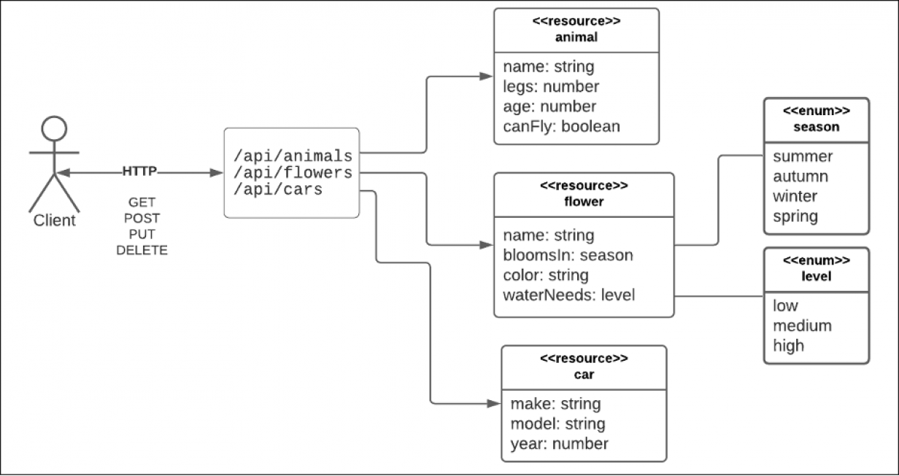
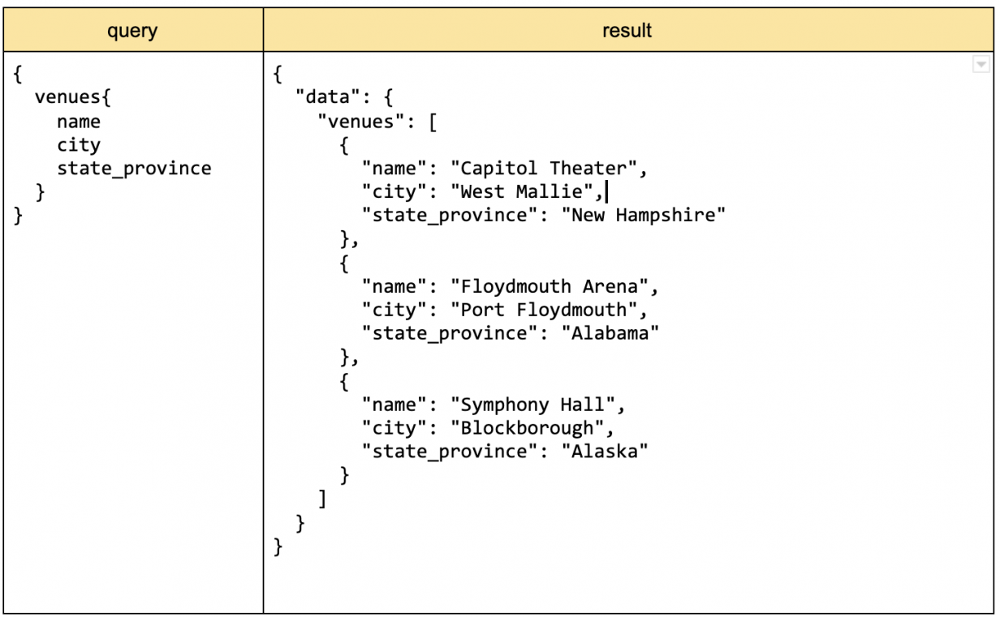

# Data Exchange
The current trend involves having clients interact with an API layer that represents the application on the server-side. This approach is beneficial because you can talk to different physical clients ex/ mobile devices, IoT devices

# SOAP
* "Simple Object Access Protocol"  
* Exchange info via Exxtensible Markup Language (XML) between a client and a procedure or service on the internet
* Can be used by different transport protocols (HTTP, FTP - asynchronous, SMTP - synchornous)
* Usually used with Web Service Description (WSDL)
    * Developers can inspect a web service that if used with WSDL
    * SDL describes how to structure the SOAP request and response messages that the given service supports, simplifying SOAP

## Message Structure
* Hierarchical structure where root element is `<soap:Envelope>` 
* The root element can have three child elements: 
    * <soap:Header>
    * <soap:Body>: required
    * <soap:Fault>

## Advantages
* can be implemented with a variety of protocols ex/ HTTP, SMTP, FTP
* supports discovery via WSDL
* language agnostic 
* beneficial to large companies with application created in different programming languages

## Disadvantages
* Complex message outfit that require lots of specification
* Protocol is bulky and hard to manage due to verboxe nature of XML and external reliance on name spaces  
* Messages can be hard and time-consuming between source and target 
* Need lots of maintenance work

# REST
* "Representational State Transfer"
* Agnostic in terms of format from data structure ex/ JSON, XMl, CSV, RSS

* Uses the concept of [Hypermedia as the Engine of Application State (HATEOAS)](##Hypermedia-as-the-Engine-of-Application-State)
* self-describing: you can understand the fields and value just by looking at the responses

# Advantages
* Easier and faster to setup than GraphQL
* can make a resource call represented by URL on internet with HTTP verb and get a 

# Disadvantages
* No control over returned data structure (need to call all of data structure even if you just need one attribute)
* Clunky and immutable in data structure -> can be slow

## Hypermedia as the Engine of Application State 
* Clients that interact with a network application whose application servers provide information dynamically through hypermedia.
* Allows for little to no prior knowledge on how to interact with an application or server beyond hypermedia

# GraphQL
* language agnostic 
* represent data 
* able to capture complexity of structures that represent graphs
* defined based on scheme language 

## Subscription
A unique feature in GraphQL are subscriptions. This allows users to get messages asynchronously when a specific event is raised in the server-side. 

### Example - Ticket Buying
When a user buys ticket, there can be a difference between seat selection and payment (in addition to verification). We can use a GraphQL subscription to send a request to hold the seat for a time being and then removed the seat from availability once payment is completed and verified to the client UI. 

## Advantage
* Express the field(s) you want to get
* Lots of nesting ex/ You can easily the post content and comments 
* Flexible in how data is returned when making query 
    * easier for frontend developers (save labour, memory, and CPU consumption)
    * filter to get results you want
* Allows asynchronous and syncronously capability in one API (two servers behind the scene)

## Disadvantages
* Longer setup and implementation time
    * more painful to do HTTP call on the backend (for example)
    * more rules to follow

## Terminology
**Query:** Similiar to a request to a REST API but can can be changed easily

# gRPC 
* uses text-based data formats: Protocol Buffers binary format

## Advantages
* exact and wicked fast: de facto standard for inter-service data exchange on the backend
* bidrectional streaming allows this communication method to be used where REST or GraphQL can't be even considered
* good for cases where developers control both client and server data exchange activities

## Disadvantages
* client and server need to support the same Protocol Buffer specification: 
    * `.proto` file needs to be carefully coordinated
    * Rest or GRAPHQL can add new attribute(s) to a esource (REST) or GraphQL without impacting the code
* no universal support for public-facing client-server interactions
    * Only 48.2% of websites on Internet support HTTP/2 
* lots of time to study but some can be saved with `protoc`
* companies that use this type of data exchange always want to increase speed

# How do we pick the right API?
* This will be heavily determine how the architecture will work, resources & budget
* For companies that is risk-averse and want to use a proven format, REST is best. 
* For companies that want to provide maximum flexibility to frontend developers to support both synchronous and asynchronous interactions between client and server, GraphQL is a good 
* To have fast, precise data exchange in 1-way or 2-way, gRPC is the way to go.

# Sources
https://www.redhat.com/architect/apis-soap-rest-graphql-grpc

https://en.wikipedia.org/wiki/HATEOAS